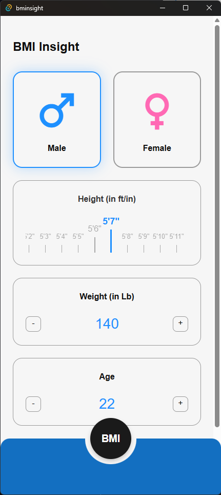
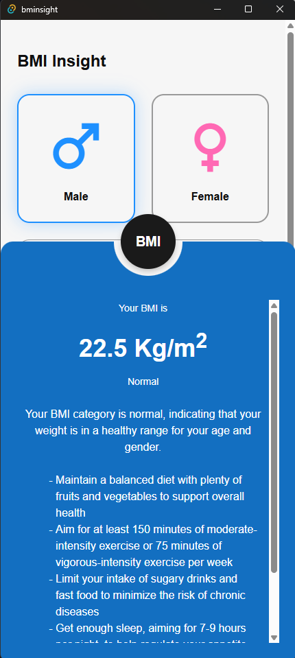

<div align="center">
    <h1>
      🔭 <br />
      BMInsight
    </h1>
    <p>
        BMInsight is a desktop application built with Tauri and Dioxus.
It calculates BMI (Body Mass Index) given user input for height, weight, age, and gender, then integrates with an LLM to provide health feedback.
    </p>
    <p style="display: flex; justify-content: center; gap: 10px;">
      
      
    </p>
</div>

## Features
- Calculate BMI from height (in inches) and weight (in pounds).

- Determine BMI category (Underweight, Normal, Overweight, Obese).

- Provide an AI-generated insight (via LLM) based on the computed BMI and user’s age/gender.


### Project Structure
Below is an overview of the major folders and files in this repo:

```text
BMInsight/
├─ assets/               # Static assets (images, CSS, etc.) for the Dioxus front end
├─ build/                # Runnable executable of the app
├─ src/
│  ├─ components/        # UI components (e.g. gender selector, ruler, scale)
│  │  ├─ gender.rs
│  │  ├─ ruler.rs
│  │  ├─ scale.rs
│  │  └─ mod.rs
│  ├─ main.rs            # Dioxus entry point
│  ├─ app.rs             # Another part of the Dioxus front-end, containing the main UI
├─ src-tauri/
│  ├─ src/             
│  │  ├─ core/           # Business logic
│  │  │  ├─ bmi.rs       # BMI calculations + categorization
│  │  │  ├─ cmd.rs       # Tauri commands bridging front-end calls to core logic
│  │  │  ├─ llm.rs       # logic for LLM provider integration
│  │  │  ├─ state.rs     # Tauri state definitions for shared data
│  │  ├─ integrations/   # Integrations for LLM providers
│  │  │  ├─ groq.rs      # Implementation for Groq-based LLM
│  │  ├─ utils/          # Reusable utility functions (e.g. rounding)
│  │  ├─ lib.rs          # Tauri app configuration
│  │  └─ main.rs         # Entry point for Tauri (calls `bminsight_lib::run()`)
│  ├─ icons/             # App icons for Tauri builds
├─ tests/
│  ├─ bmi_tests.rs       # Tests for BMI logic (separate test file or integrated tests)
├─ Cargo.toml            # Rust manifest for the entire project
├─ tauri.conf.json       # Tauri configuration file
```


## Running as an Executable
If you want to run the application without building it manually, simply navigate to the `build/` folder and execute :

### On Windows
Just open the `bminsight_0.1.0_x64-setup.exe` file.

## Building manually
### Prerequisites
To build the project yourself, you need : 
- `rustup` and `cargo` installed
  - You can install `rustup` from [this link](https://rustup.rs/). 
  - Add it to environment variables if it's not already added.
- `Tauri-cli` 
    ```bash
    cargo install tauri-cli --locked
    ```
- `Dioxus-cli`
    ```bash
    cargo install dioxus-cli --locked
    ```
  
### Dev mode 
To start the app in dev mode 
```bash
cargo tauri dev
```
This compiles the Rust backend and launches a dev window for testing. Any changes to the Rust or Dioxus
code will be automatically reloaded.


### Build 
To manually build the project :


```bash
cargo tauri build
```

After a successful build, you’ll find the final installer or executable inside `src-tauri/target/release/bundle/

## Testing
> The test suite primarily verifies BMI computation and category classification using Boundary Value Analysis (BVA) and Equivalence Partitioning.

To execute all tests, navigate to `src-tauri` folder and run the following command:
```bash
cargo test
```
This will compile and run all unit tests defined in the tests/ folder and core logic files.
